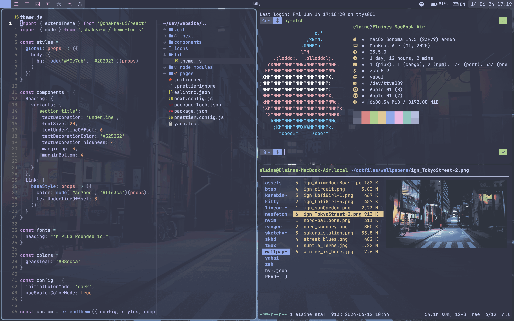
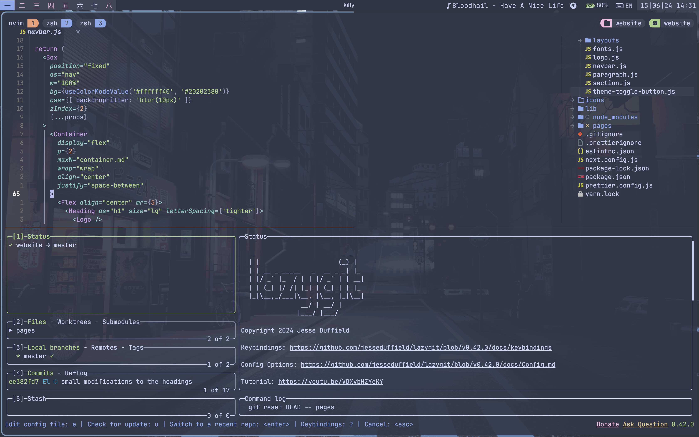
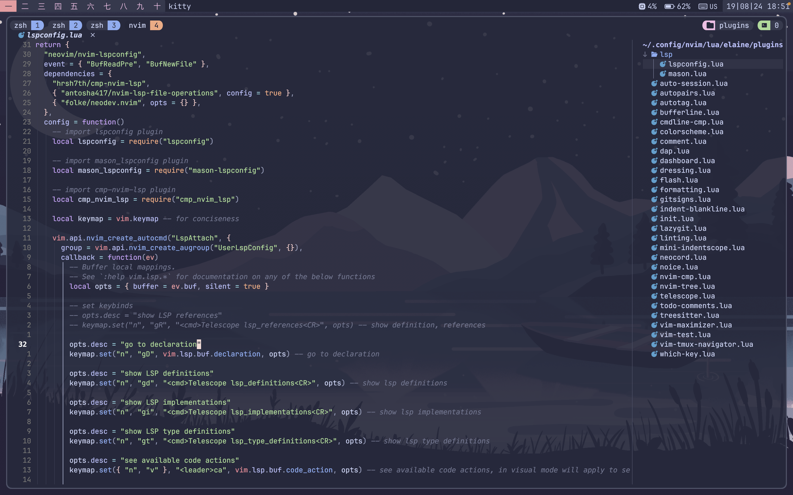

# MacOS Dot-files

My Personal Dotfile >:3

## Screenshots

## Programs

| Function         | Item                                                                                                              |
| ---------------- | ----------------------------------------------------------------------------------------------------------------- |
| Window Manager   | [Yabai](https://github.com/koekeishiya/yabai)                                                                     |
| Bar              | [Sketchybar](https://github.com/FelixKratz/SketchyBar)                                                            |
| Hotkey Daemon    | [shkd](https://github.com/koekeishiya/skhd), [Karabiner Elements](https://github.com/pqrs-org/Karabiner-Elements) |
| Terminal         | [Kitty](https://github.com/kovidgoyal/kitty), [tmux](https://github.com/tmux/tmux)                                |
| Text Editor      | [Neovim](https://github.com/neovim/neovim)                                                                        |
| File Explorer    | [Yazi](https://github.com/sxyazi/yazi)                                                                            |
| Theme            | [Catppuccin](https://github.com/catppuccin)                                                                       |
| Shell            | [Zsh](https://www.zsh.org/)                                                                                       |
| Shell Extensions | [Zoxide](https://github.com/ajeetdsouza/zoxide), [Eza](https://github.com/eza-community/eza)                      |
